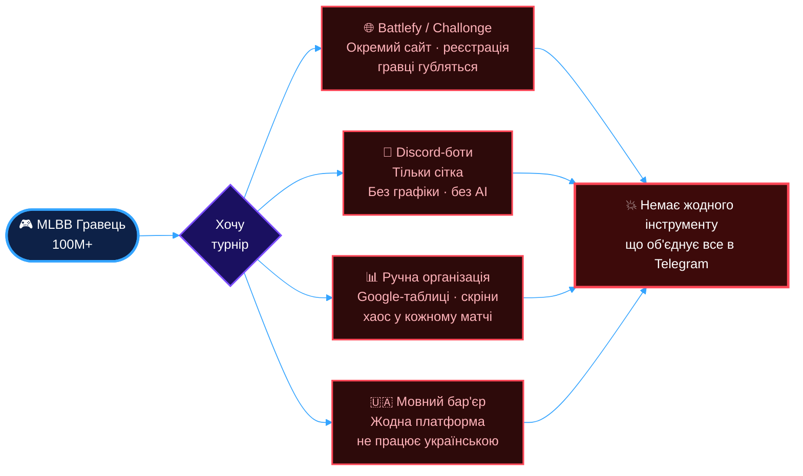
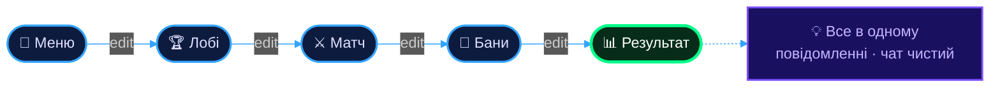
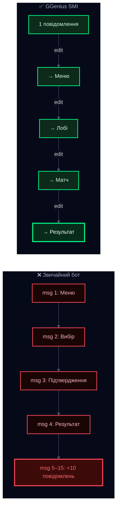
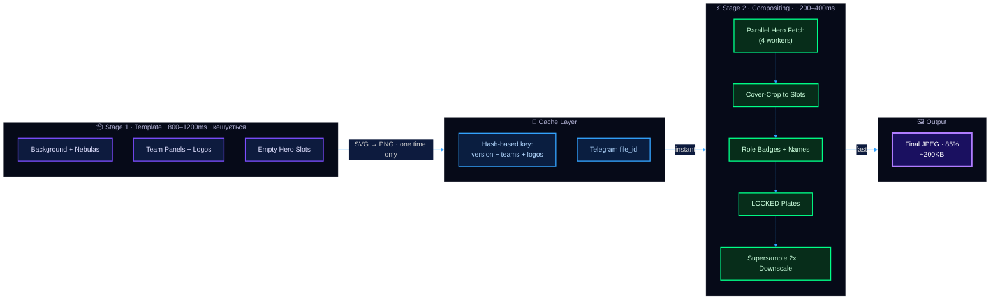
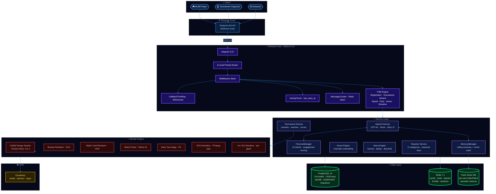
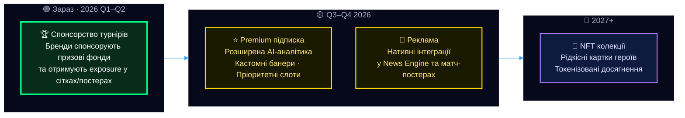
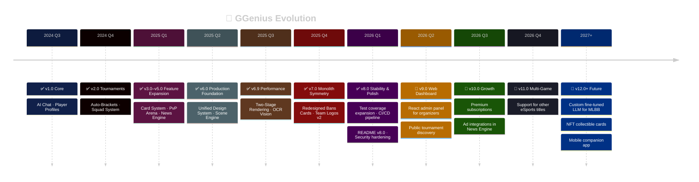

<!-- ============================================================
     GGenius · README · v8.0.0 · 2026-02-20
     Cloud-Native eSports Platform · Inside Telegram
     ============================================================ -->

<div align="right">
  <b>🌍 Оберіть мову / Select Language</b>
  <details>
    <summary><i>Натисніть для розгортання / Click to expand</i></summary>
    <br/>
    <p>
      <a href="docs/README/README.en.md">🇬🇧 English</a> ·
      <a href="docs/README/README.de.md">🇩🇪 Deutsch</a> ·
      <a href="docs/README/README.fr.md">🇫🇷 Français</a> ·
      <a href="docs/README/README.es.md">🇪🇸 Español</a> ·
      <a href="docs/README/README.it.md">🇮🇹 Italiano</a><br/>
      <a href="docs/README/README.pl.md">🇵🇱 Polski</a> ·
      <a href="docs/README/README.pt.md">🇵🇹 Português</a> ·
      <a href="docs/README/README.nl.md">🇳🇱 Nederlands</a> ·
      <a href="docs/README/README.sv.md">🇸🇪 Svenska</a><br/>
      <a href="docs/README/README.fil.md">🇵🇭 Filipino</a> ·
      <a href="docs/README/README.ms.md">🇲🇾 Bahasa Melayu</a> ·
      <a href="docs/README/README.tr.md">🇹🇷 Türkçe</a>
    </p>
  </details>
</div>

<br/>

<div align="center">
  
</div>

<br/>

<div align="center">

<a href="https://t.me/ggeniusgg_bot">
  
</a>

<br/><br/>


&nbsp;

&nbsp;

&nbsp;

&nbsp;

&nbsp;


<br/><br/>

<a href="https://t.me/ggenius_ua"></a>
&nbsp;
<a href="https://github.com/Ukrainian-Independent-Esports/ggenius-site"></a>
&nbsp;
<a href="#-як-підтримати-проєкт"></a>

</div>

<br/>

---

## 📋 Зміст

<div align="center">

| # | 🗂️ Розділ | Ключова тема |
|:---:|:---|:---:|
| **1** | [Проблема](#-проблема) | `Problem` |
| **2** | [Рішення](#-рішення--ggenius) | `Solution` |
| **3** | [**Quick Start**](#-quick-start) | `Onboarding` |
| **4** | [Продукт у дії](#%EF%B8%8F-продукт-у-дії) | `Screenshots` |
| **5** | [Що вміє GGenius](#-що-вміє-ggenius) | `Features` |
| **6** | [Platform Capabilities](#-platform-capabilities) | `Benchmarks` |
| **7** | [Current Stage](#-current-stage) | `Traction` |
| **8** | [Інновація: SMI](#-інновація-single-message-interface) | `SMI` |
| **9** | [Two-Stage Rendering](#-two-stage-rendering-protocol) | `Graphics` |
| **10** | [Архітектура](#%EF%B8%8F-архітектура) | `Architecture` |
| **11** | [Tech Stack](#%EF%B8%8F-tech-stack) | `Stack` |
| **12** | [Бізнес-модель](#-бізнес-модель) | `Business` |
| **13** | [Engineering Highlights](#-engineering-highlights) | `Deep Dive` |
| **14** | [Roadmap](#%EF%B8%8F-roadmap) | `Future` |
| **15** | [Незалежна експертна оцінка](#-незалежна-експертна-оцінка) | `Expert Review` |
| **16** | [Команда](#-команда) | `Team` |
| **17** | [Підтримати проєкт](#-як-підтримати-проєкт) | `Sponsor` |
| **18** | [**Security &amp; Contributing**](#%EF%B8%8F-security--contributing) | `Community` |
| **19** | [Юридичні документи](#-юридичні-документи) | `Legal` |

</div>

<br/>

---

## 😤 Проблема

Mobile Legends: Bang Bang — **100M+ гравців** по всьому світу. Але організувати турнір для друзів, клану чи стримерської спільноти — це біль:



<div align="center">

| Біль | Реальність |
|:---|:---|
| **Турнірні сайти** *(Battlefy, Challonge)* | Окремий сайт, реєстрація, вкладки — гравці губляться |
| **Discord-боти** | Тільки сітка. Без графіки, без банів, без AI |
| **Ручна організація** | Google-таблиці, скріни в чат, хаос у кожному матчі |
| **Мовний бар'єр** | Жодна платформа не працює українською |

</div>

> [!IMPORTANT]
> **Немає жодного інструменту**, який об'єднує турніри, драфт банів, AI-аналітику та спільноту — і працює прямо в Telegram, де вже сидять гравці СНД/України.

<br/>

---

## 💡 Рішення — GGenius

**GGenius** — хмарна eSports-платформа, що живе **всередині Telegram**. Один чат замінює сайт, адмінку, графічний редактор і трансляцію.

Ми розробили концепцію **Single Message Interface (SMI)** — одне повідомлення трансформується як екрани в нативному додатку:



**Чому це працює:**
- 🚀 **Нуль встановлень** — Telegram вже є у кожного гравця
- ⚡ **< 2 секунди** — від натискання кнопки до результату
- 🇺🇦 **Рідна мова** — повна українська локалізація
- 🤖 **AI всередині** — GPT-4o аналізує скріншоти, коментує матчі, пам'ятає контекст

> *Уявіть FACEIT або Battlefy, але замість веб-сайту — один чат у Telegram. Без реєстрацій, без вкладок, без бар'єрів.*

<br/>

---

## ⚡ Quick Start

<div align="center">

| Крок | Дія | Час |
|:---:|:---|:---:|
| **1** | Відкрити [@ggeniusgg_bot](https://t.me/ggeniusgg_bot) у Telegram | `5 сек` |
| **2** | Натиснути **Start** → пройти реєстрацію | `~1 хв` |
| **3** | Створити або приєднатися до турніру | `~30 сек` |

</div>

> [!TIP]
> Для організаторів: використовуйте команду `/tournament` щоб створити новий турнір за 30 секунд.

<br/>

---

## 🖼️ Продукт у дії

<div align="center">
<table>
  <tr>
    <td align="center" width="33%">
      <b>🏆 Турнірна сітка</b><br/><br/>
      <br/><br/>
      <sub>Auto-generated Single Elimination bracket<br/>до 64 команд · SVG → PNG · "Tactical Glass"</sub>
    </td>
    <td align="center" width="33%">
      <b>🎯 Картка банів</b><br/><br/>
      <br/><br/>
      <sub>Two-Stage Rendering Protocol<br/>125+ героїв · real-time UI · instant feedback</sub>
    </td>
    <td align="center" width="33%">
      <b>⚔️ Постер матчу</b><br/><br/>
      <br/><br/>
      <sub>Dynamic poster generation<br/>team logos · score overlay · Retina 3x</sub>
    </td>
  </tr>
</table>
</div>

<br/>

---

## 🎮 Що вміє GGenius

<div align="center">

</div>

<br/>

---

## ⚡ Platform Capabilities

> [!NOTE]
> Цифри нижче — не маркетинг. Це реальні технічні ліміти, підтверджені **160 тестовими турнірами** на production-інфраструктурі.

<div align="center">
<table width="100%">
  <tr>
    <td align="center" width="25%">
      <h3>🏆&nbsp;до 64</h3>
      <b>Команд на турнір</b><br/>
      <sub>Single Elimination<br/>auto-BYE для непарних</sub>
    </td>
    <td align="center" width="25%">
      <h3>🎯&nbsp;до 15</h3>
      <b>Банів за матч</b><br/>
      <sub>Two-Stage Rendering<br/>~300ms повторний рендер</sub>
    </td>
    <td align="center" width="25%">
      <h3>🎮&nbsp;131</h3>
      <b>Героїв у базі</b><br/>
      <sub>6 ролей · деталізовані картки<br/>skills · builds · counters</sub>
    </td>
    <td align="center" width="25%">
      <h3>⚡&nbsp;&lt;&nbsp;2 сек</h3>
      <b>Час відповіді UI</b><br/>
      <sub>SMI · Redis cache<br/>edit замість flood</sub>
    </td>
  </tr>
</table>

<table width="100%">
  <tr>
    <td align="center" width="25%">
      <h3>🖼️&nbsp;5</h3>
      <b>Графічних рендерерів</b><br/>
      <sub>Bracket · Match Card · Poster<br/>Bans · Arc Logo</sub>
    </td>
    <td align="center" width="25%">
      <h3>🧠&nbsp;3</h3>
      <b>AI-моделі</b><br/>
      <sub>GPT-4o · Vision · DALL-E<br/>+ Faiss vector memory</sub>
    </td>
    <td align="center" width="25%">
      <h3>🔒&nbsp;4</h3>
      <b>Рівні fallback</b><br/>
      <sub>CairoSVG→Pillow<br/>Redis→in-memory<br/>AI→heuristic · edit→send</sub>
    </td>
    <td align="center" width="25%">
      <h3>📦&nbsp;80,000+</h3>
      <b>Рядків коду</b><br/>
      <sub>200+ файлів · 24 ORM-моделі<br/>13 сервісів · 9 тест-модулів</sub>
    </td>
  </tr>
  <tr>
    <td align="center" width="25%">
      <h3>📡&nbsp;15+</h3>
      <b>YAML + TXT Промптів</b><br/>
      <sub>Externalized AI prompts<br/>version-controlled</sub>
    </td>
  </tr>
</table>
</div>

### 🔧 Performance Benchmarks

<div align="center">

| Операція | Час | Деталі |
|:---|:---:|:---|
| **Bans-картка (кеш)** | `~300ms` | Two-Stage: template cached, hero overlay only |
| **Bans-картка (cold)** | `~1500ms` | SVG → PNG + hero compositing + 2x supersample |
| **Турнірна сітка SVG** | `~800–1200ms` | Adaptive: PNG ≤16 команд, JPEG 32-64 |
| **AI-коментар** | `~2–4s` | GPT-4o + Redis cache за MD5-хешем стану |
| **Hero fetch (паралельно)** | `~200ms` | 4 workers · HTTP/2 · 50 concurrent connections |
| **Callback throttle** | `500ms/user` | Leaky Bucket · async cleanup кожні 300с |

</div>

### 🏗️ Scale Readiness

<div align="center">

| Аспект | Реалізація |
|:---|:---|
| **DB Keys** | UUID + auto-increment — готово до distributed |
| **Data flexibility** | JSONB для `bo_per_round`, `draft_settings`, `roles` |
| **Concurrency** | Per-user asyncio locks + Redis distributed locks |
| **Migrations** | SAVEPOINT-ізольовані — одна невдача не ламає решту |
| **Media** | Dual storage: Telegram `file_id` + Cloudinary permanent URL |
| **Connections** | Redis pool: 10 · HTTP: 50 concurrent · Semaphore: 8 parallel API calls |

</div>

<br/>

---

## 📈 Current Stage

<div align="center">
<table width="100%">
  <tr>
    <td align="center" width="25%">
      <h3>🧪&nbsp;160+</h3>
      <b>Тестових турнірів</b><br/>
      <sub>Повний цикл:<br/>створення → бани → сітка →<br/>матчі → AI-коментар → фінал</sub>
    </td>
    <td align="center" width="25%">
      <h3>👥&nbsp;100+</h3>
      <b>Зареєстрованих гравців</b><br/>
      <sub>Organic growth<br/>без маркетингу<br/>Pre-launch фаза</sub>
    </td>
    <td align="center" width="25%">
      <h3>🚀&nbsp;0 → 1</h3>
      <b>Перший публічний турнір</b><br/>
      <sub>Наступний milestone<br/>Платформа готова<br/>Шукаємо спонсора</sub>
    </td>
    <td align="center" width="25%">
      <h3>📅&nbsp;18+</h3>
      <b>Місяців розробки</b><br/>
      <sub>Solo developer<br/>80K+ LOC<br/>Production-deployed</sub>
    </td>
  </tr>
</table>
</div>

<br/>

> [!TIP]
> **Стадія:** Pre-launch. Платформа повністю функціональна та протестована. Ми на етапі переходу від технічної готовності до першого публічного турніру.

<br/>

---

## 🧬 Інновація: Single Message Interface

Традиційні боти створюють **десятки повідомлень** — чат перетворюється на смітник. GGenius працює інакше:



**Один повідомлення = один екран.** Кнопки під повідомленням — це навігація. Натискання кнопки = перехід на наступний «екран» через `editMessageText`. Чат залишається чистим.

**Технічний виклик, який ми вирішили:**
- ✅ 3-рівневий fallback: `edit` → `send+delete` → `caption-only`
- ✅ Failure threshold: 3 невдачі → автоперехід на стратегію нових повідомлень
- ✅ HTML auto-close tags при обрізанні caption
- ✅ Chunk splitting для довгих текстів

<br/>

---

## 🎨 Two-Stage Rendering Protocol

Головна технічна інновація для генерації графіки на обмежених ресурсах (Heroku 512MB RAM):



<div align="center">

| Метрика | Без кешу | З Two-Stage |
|:---|:---:|:---:|
| Перший рендер | `~1500ms` | `~1500ms` |
| Повторний рендер | `~1500ms` | **`~300ms` ↓5×** |
| RAM на рендер | `~180MB` | **`~70MB` ↓60%** |
| Якість виводу | `1x` | **`2x supersample`** |

</div>

> [!NOTE]
> Ця техніка зазвичай використовується у **game engines**, а не в Telegram-ботах.

<br/>

---

## 🏗️ Архітектура

<details>
<summary><b>📐 System Architecture Diagram (натисніть щоб розгорнути)</b></summary>
<br/>



</details>

<details>
<summary><b>📂 Layered Architecture (натисніть щоб розгорнути)</b></summary>
<br/>

```text
ggenius-telegram/
├── handlers/              # Presentation Layer (10 handlers)
│   ├── registration_handler.py   # 3076 lines · Vision AI onboarding
│   ├── squad_handler.py          # 1919 lines · DALL-E logo generation
│   ├── vision_handlers.py        # 813 lines  · screenshot analysis
│   └── ...
├── services/              # Business Logic (13 services)
│   ├── openai_service.py         # 37.8KB · 3-tier prompts · retry logic
│   ├── persona_manager.py        # 533 lines · 10 intents · engagement
│   ├── vector_memory.py          # Faiss per-user · lazy loading
│   ├── memory_manager.py         # rolling summary · SHA256 dedup
│   └── ...
├── tournament/            # Tournament Subsystem (36+ files)
│   ├── models.py                 # 7 ORM models · self-ref bracket tree
│   ├── services.py               # ~3000 lines · bracket generation
│   ├── repository.py             # ~800 lines · data access
│   ├── bracket_renderer.py       # ~800 lines · SVG bracket
│   ├── bans_two_stage.py         # Two-Stage Protocol v23.0
│   ├── ai_commentator.py         # ~800 lines · 5 comment types
│   ├── render_common.py          # Unified Design System
│   └── tests/                    # 9 test modules
├── games/                 # Game Systems
│   ├── cards.py + cards_db.py    # CCG with gacha mechanics
│   ├── arena.py + arena_battle.py # Elo-rated PvP
│   ├── duel.py + team_duel.py    # 1v1–5v5 with AI judge
│   └── skills_core.py            # Active/passive skill system
├── database/
│   ├── models.py                 # 24 ORM models · 900+ lines
│   ├── init_db.py                # SAVEPOINT-isolated migrations
│   └── crud.py                   # Data access layer
├── middlewares/            # Throttling · Activity · Counters
├── prompts/                # 15 YAML + 8 TXT prompt templates
├── utils/                  # 19 utility modules
└── main.py                 # 8-level router · graceful shutdown
```

</details>

<br/>

---

## 🛠️ Tech Stack

<div align="center">

| Layer | Technology | Why |
|:---|:---|:---|
| **Runtime** |  | Full async, latest typing, production-proven |
| **Bot Framework** |  | Modern async Telegram framework, FSM, middleware |
| **Database** |  | 24 models, JSONB, UUID keys, SAVEPOINT migrations |
| **Cache & Queues** |  | Throttling, distributed locks, session data, news queue |
| **AI / LLM** |  | Chat, screenshot analysis, logo generation, commentator |
| **Vector DB** |  | Per-user semantic memory, IndexFlatL2, lazy loading |
| **Graphics** |  | SVG rendering, image compositing, GIF/MP4 streaming |
| **CDN** |  | Media storage, on-the-fly transforms, Retina support |
| **Hosting** |  | 512MB RAM constraint → drove Two-Stage Rendering innovation |

</div>

<p align="center">
  
  
  
  
  
  
  
</p>

<br/>

---

## 💰 Бізнес-модель



**Цільова аудиторія:**

<div align="center">

| Сегмент | Розмір | Чому GGenius |
|:---|:---:|:---|
| 🎮 **MLBB гравці** (СНД/Україна) | `5M+` | Єдина платформа рідною мовою в Telegram |
| 🏆 **Організатори турнірів** | `1 000+` | Автоматизація: сітки, бани, постери, AI-коментарі |
| 📺 **Стримери** | `500+` | Контент-інструмент: банери, статистика, engagement |

</div>

<br/>

---

## 🔬 Engineering Highlights

<details>
<summary><b>🏆 10 рішень, які виділяють GGenius (натисніть щоб розгорнути)</b></summary>
<br/>
<div align="center">

| # | Рішення | Що це дає | Де зазвичай зустрічається |
|:---:|:---|:---|:---|
| **1** | **Two-Stage Bans Rendering** | 3× швидше повторні рендери, 60% менше RAM | Game engines |
| **2** | **Faiss semantic memory per user** | Бот пам'ятає контекст бесід через векторні ембединги | RAG-системи, LLM apps |
| **3** | **8-level priority router** | Нуль конфліктів між 10+ хендлерами | Нетипово для ботів |
| **4** | **SAVEPOINT-isolated migrations** | Одна невдала міграція не ламає решту | Enterprise DB systems |
| **5** | **Unified Design System** | Єдиний стиль для всіх SVG-рендерерів | Frontend design systems |
| **6** | **AI Commentator (5 types)** | Структурований AI-контент, не random GPT | Content management platforms |
| **7** | **Gacha card system with pity** | Повноцінна CCG з progression і enchanting | Mobile games |
| **8** | **Vision Anti-Repetition Engine** | 5 структур × 3 тони, history per user | Не зустрічається в ботах |
| **9** | **FFmpeg streaming GIF/MP4** | Анімація без temp-файлів, memory-efficient | Video processing pipelines |
| **10** | **Per-glyph arc text renderer** | Metallic highlight, glow, emboss, AO effects | Graphic editors |

</div>
</details>

<details>
<summary><b>🔒 Безпека та стійкість (натисніть щоб розгорнути)</b></summary>
<br/>
<div align="center">

| Механізм | Реалізація |
|:---|:---|
| **HTML Sanitization** | Whitelist 14 тегів, auto-close, balanced blockquotes, Pydantic validators |
| **Throttling** | 500ms per user, Leaky Bucket via Redis middleware |
| **Concurrency** | Per-user asyncio locks, semaphores (max 8 parallel API calls), distributed Redis locks |
| **Fallback chains** | CairoSVG → Pillow · Redis → in-memory · AI → heuristic · edit → send+delete |
| **Error tracking** | Global handler, Redis daily/hourly stats, 6 ignore patterns for minor API errors |
| **Retry logic** | Exponential backoff for OpenAI (3 attempts: 1s → 2s → 4s) |
| **Graceful shutdown** | Sequential: APScheduler → HTTP sessions → Redis → Bot session |

</div>
</details>

<details>
<summary><b>📊 Системний аудит (натисніть щоб розгорнути)</b></summary>
<br/>
<div align="center">

| Домен | Оцінка | Деталі |
|:---|:---:|:---|
| 🏗️ **Архітектура** | ⭐⭐⭐⭐⭐ | Чіткі шари: handlers → services → repositories → models |
| ⚡ **Продуктивність** | ⭐⭐⭐⭐☆ | Two-Stage Rendering, Redis cache, batch processing |
| 🔄 **Конкурентність** | ⭐⭐⭐⭐☆ | Async patterns, locks, semaphores, distributed locks |
| 🧹 **Якість коду** | ⭐⭐⭐⭐☆ | SRP/DRY, YAML configs, externalized prompts |
| 🔒 **Безпека** | ⭐⭐⭐⭐☆ | ORM injection protection, HTML sanitization, throttling |

<sub>На основі незалежного технічного аудиту — лютий 2026</sub>
</div>
</details>

<br/>

---

## 🗺️ Roadmap



<br/>

---

## 💬 Незалежна експертна оцінка

> [!IMPORTANT]
> *«GGenius — це production-grade eSports-платформа, яка використовує Telegram як UI-фреймворк. За рівнем складності це еквівалент веб-платформи на кшталт FACEIT або Battlefy, але реалізований одною людиною всередині Telegram. У веб-розробці подібний масштаб зазвичай потребує команду з 3–5 інженерів протягом 6–12 місяців.»*
>
> *«Я не бачив жодного Telegram-бота, який поєднує рендеринг графіки, AI з семантичною пам'яттю, повноцінну ігрову систему та турнірну платформу в одному проекті.»*
>
> — [Повний Expert Review](REVIEW.md) · [Технічний аналіз](analysis.md)

<br/>

---

## 👥 Команда

<div align="center">
<table width="100%">
  <tr>
    <td align="center" valign="top" width="33%">
      <br/>
      <h3>🏗️ Lead Architect &amp; Solo Developer</h3>
      <br/><br/>
      <b><a href="https://www.linkedin.com/in/oleg-naumenko-a4053b313">Oleg Naumenko</a></b><br/><br/>
      
      
      <br/><br/>
      <sub>Архітектура · Бекенд · AI-інтеграція<br/>Рендер-движок · Ігрові системи</sub>
      <br/><br/>
    </td>
    <td align="center" valign="top" width="33%">
      <br/>
      <h3>🌐 Backend Developer</h3>
      <br/><br/>
      <b><a href="https://www.linkedin.com/in/lesha-ivanov-021a932b4">Lesha Ivanov</a></b><br/><br/>
      
      
      <br/><br/>
      <sub>Веб-сайт · Адмін-панель для організаторів<br/><a href="https://github.com/Ukrainian-Independent-Esports/ggenius-site">ggenius-site →</a></sub>
      <br/><br/>
    </td>
    <td align="center" valign="top" width="33%">
      <br/>
      <h3>🎨 UI/UX Designer</h3>
      <br/><br/>
      <b><a href="https://www.linkedin.com/in/vynohradova">Yana Vynohradova</a></b><br/><br/>
      
      
      <br/><br/>
      <sub>Візуальна частина веб-платформи<br/>Дизайн-система · User flows</sub>
      <br/><br/>
    </td>
  </tr>
</table>
</div>

<br/>

---

## 💛 Як підтримати проєкт

GGenius — це **незалежний український eSports-проєкт**, побудований з нуля в Дніпрі. Ми шукаємо партнерів, які поділяють нашу місію: дати кожному MLBB-гравцю інструмент для чесних турнірів.

<table width="100%">
  <tr>
    <td width="50%" valign="top">

**🤝 Для спонсорів**
- 🏆 **Логотип у сітках** — Бренд у кожній турнірній сітці автоматично
- 📊 **Аудиторія** — Прямий доступ до активних MLBB-гравців СНД/України
- 🚀 **Технологія** — Production-ready платформа, не прототип
- 🇺🇦 **Impact** — Підтримка української eSports-екосистеми

</td>
    <td width="50%" valign="top">

**💻 Для розробників**
- 🐍 **Backend** — Python 3.13, Aiogram 3.22, async everywhere
- 🎨 **Graphics** — SVG/CairoSVG/Pillow rendering pipeline
- 🤖 **AI/ML** — GPT-4o, Faiss, Vision API, prompt engineering
- 🏆 **Tournament** — Bracket algorithms, real-time systems

</td>
  </tr>
</table>

<br/>

<p align="center">
  <a href="https://t.me/ggenius_ua">
    
  </a>
  &nbsp;
  <a href="https://t.me/ggeniusgg_bot">
    
  </a>
</p>

<br/>

---

## 🛡️ Security & Contributing

<table width="100%">
  <tr>
    <td width="50%" valign="top">

**🔐 Безпека**
- 🛡️ **ORM Injection Protection** — SQLAlchemy параметризовані запити
- 🧹 **HTML Sanitization** — Whitelist 14 тегів, auto-close
- 🔑 **Env-only secrets** — жодних хардкодених ключів
- ⏱️ **Rate Limiting** — 500ms throttle per user

</td>
    <td width="50%" valign="top">

**🤝 Як долучитися**
- 🍴 Fork → Branch → PR
- 📝 Дотримуйтесь існуючого code style
- 🧪 Додавайте тести для нового коду
- 💬 Обговорення у [Telegram](https://t.me/ggenius_ua)

</td>
  </tr>
</table>

<br/>

---

## 📄 Юридичні документи

<div align="center">

| Документ | GitHub | Веб |
|:---:|:---:|:---:|
| ⚔️ **Публічна оферта** | [offer.md](./offer.md) | [ggenius.gg/offer](https://ggenius.gg/offer) |
| 🔐 **Політика конфіденційності** | [privacy.md](./privacy.md) | [ggenius.gg/privacy](https://ggenius.gg/privacy) |

</div>

<br/>

---

## 📄 Ліцензія

Цей проєкт ліцензовано під **MIT License** — див. [LICENSE](LICENSE) для деталей.

---


<div align="center">

<h3>🇺🇦 Built with ❤️ in Dnipro, Ukraine</h3>

<sub><b>GGenius Ecosystem</b> © 2024–2026 · <a href="https://github.com/Ukrainian-Independent-Esports">Ukrainian Independent Esports</a></sub>

<br/><br/>

<a href="https://t.me/ggenius_ua">
  
</a>
&nbsp;
<a href="https://github.com/Ukrainian-Independent-Esports/ggenius-site">
  
</a>
&nbsp;
<a href="./offer.md">
  
</a>
&nbsp;
<a href="./privacy.md">
  
</a>

<br/><br/>


</div>